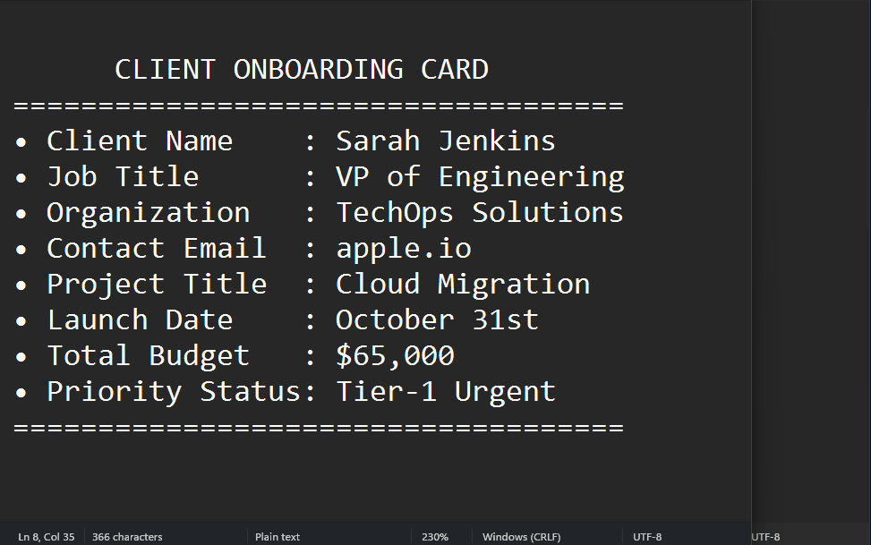

<div align="center">


# QPaste

**Copy multiple items in sequence. Paste them back in order. No tab-switching.**

[](https://github.com/chinthanasathyajithcs/qpaste)
[](https://www.python.org/)
[](https://riverbankcomputing.com/software/pyqt/)
[](https://github.com/chinthanasathyajithcs/qpaste/releases/latest)
[](https://github.com/chinthanasathyajithcs/qpaste/releases)
[](src/tests)
[](LICENSE)

[**Download Installer**](https://github.com/chinthanasathyajithcs/qpaste/releases/latest) &nbsp;·&nbsp; [**Download Portable**](https://github.com/chinthanasathyajithcs/qpaste/releases/latest) &nbsp;·&nbsp; [**Documentation**](docs/PRD.md)

<br />



</div>

---

## The Problem and the Fix

Windows clipboard holds one item. Copy a second thing and the first is gone. Collecting ten snippets across documents means ten round-trips between windows.

QPaste wraps your clipboard in a FIFO queue. Press `F4`, copy everything you need in one pass, then paste each item back in order with `Ctrl+V`. When the queue drains, `Ctrl+V` reverts to normal Windows paste. The app lives in the system tray with no taskbar footprint.

---

## How It Works

```
QUEUE MODE (F4 toggles ON/OFF)
================================

  Source documents               Your queue              Target document
  ----------------               ----------              ---------------
  [Doc A] Ctrl+C "Alice"  --->  [ Alice   ]  (front)
  [Doc B] Ctrl+C "Bob"    --->  [ Bob     ]
  [Doc C] Ctrl+C "Carol"  --->  [ Carol   ]  (back)
                                     |
                            Ctrl+V pops front
                                     |
                                     v
                            [Target] "Alice" pasted
                            [Target] "Bob"   pasted
                            [Target] "Carol" pasted


QUICK NOTEPAD HUD (F3 toggles)
=================================

  +---------------------------+
  | | Quick Notepad       [x] |   Frameless, always-on-top
  +---------------------------+   Dark theme, Consolas 10pt
  |                           |   Drag by title bar
  |  scratch notes here...    |   Auto-saves on every keystroke
  |                           |   Persists across restarts
  |                           |   Esc to dismiss
  +---------------------------+
        Floating HUD, 380x280px (resizable)
```

---

## Hotkey Cheat Sheet

| Key | Action | Configurable |
|---|---|---|
| `F4` | Toggle Queue Mode ON / OFF | Yes |
| `Shift+F4` | Clear all queued items | Yes |
| `F3` | Toggle Quick Notepad HUD | Yes |
| `Ctrl+C` | Copy into queue (when Queue Mode is ON) | No |
| `Ctrl+V` | Paste next queued item (falls back to OS paste when empty or OFF) | No |

**To remap a key:** open the Queue Inspector (tray icon or `F4` long press), go to the **Settings** tab, click into any hotkey field, type a new combination (e.g. `Ctrl+F4`, `Alt+Q`), and it saves immediately. Click **Reset Defaults** to restore the original bindings.

Valid combo formats: `F4`, `Shift+F4`, `Ctrl+Alt+V`, `Alt+F3`. Modifier order does not matter. Invalid combos are rejected with an inline error.

---

## Core Features

### Office and Word Multi-Copy Debounce

When you copy a cell or paragraph in Word or Excel, Windows fires `WM_CLIPBOARDUPDATE` multiple times in rapid succession as the app registers different clipboard formats (RTF, HTML, plain text, etc.). Without a guard, QPaste would queue the same content two or three times per keypress.

The fix: a 200ms debounce window. Any clipboard update that arrives within 200ms of the previous one for the same text string is dropped silently. A second guard, `ignore_consecutive_duplicates`, extends that window to 1 second. Both are tunable from `config.json`.

### Activity-Based Idle Auto-Clear

Enable Auto-Clear in Settings to automatically purge the queue after a period of inactivity. Two modes:

- **Idle Inactivity** (default): clears the queue N seconds after the last copy or paste action. The timer resets on every queue interaction.
- **Fixed TTL**: purges individual items that are older than N seconds, regardless of recent activity.

Available durations: 30s, 1m, 5m, 15m, 30m, 1h. Disabled by default.

### Floating Dark HUD Notepad

Press `F3` to open a frameless, always-on-top scratchpad. It saves automatically every 300ms after you stop typing and restores your content the next time you open QPaste. Drag it anywhere by the title bar. Press `Esc` or click `x` to dismiss without losing content.

---

## Installation

### Direct Downloads

- **[QPaste_Setup_v1.0.0.exe](https://github.com/chinthanasathyajithcs/qpaste/releases/latest)** — Windows installer. Installs to `%LocalAppData%\Programs\QPaste`, adds Start Menu shortcuts and optional autostart.
- **[qpaste.exe](https://github.com/chinthanasathyajithcs/qpaste/releases/latest)** — Portable single executable, no installation required.

### Package Managers

```powershell
# winget
winget install QPaste

# Scoop
scoop bucket add qpaste https://github.com/chinthanasathyajithcs/qpaste
scoop install qpaste

# Chocolatey
choco install qpaste
```

---

## Developer Guide

### Prerequisites

| Requirement | Version | Notes |
|---|---|---|
| Python | 3.11+ | Tested on 3.11 and 3.12 |
| OS | Windows 10 / 11 | Win32 clipboard APIs required |
| PyInstaller | latest | Only for building `.exe` |
| Inno Setup | 6.x | Only for building the installer |

### Running from Source

```powershell
git clone https://github.com/chinthanasathyajithcs/qpaste.git
cd qpaste

python -m venv src\.venv
.\src\.venv\Scripts\Activate.ps1

pip install -r src\requirements.txt

python3 src\main.py
```

### Running Tests

```powershell
python3 -m unittest discover -s src/tests
```

The test suite covers queue operations, debounce logic, hotkey parsing, auto-clear modes, notepad persistence, and UI integration (78 tests total).

### Building Binaries

```powershell
# Standalone executable -> dist/qpaste.exe
python -m PyInstaller qpaste.spec

# Setup installer -> installer/Output/QPaste_Setup_v1.0.0.exe
ISCC.exe installer\qpaste_setup.iss
```

### Configuration File

On Windows, settings persist to `%APPDATA%\QPaste\config.json`. On other platforms (dev/test), it falls back to a `config.json` in the repo root. You can edit it directly; QPaste loads it on startup and writes back on every change.

Key fields:

```json
{
  "auto_clear_enabled": false,
  "auto_clear_seconds": 60,
  "auto_clear_mode": "idle",
  "debounce_ms": 200.0,
  "ignore_consecutive_duplicates": true,
  "duplicate_window_sec": 1.0,
  "hotkeys": {
    "toggle_queue": "F4",
    "clear_queue": "Shift+F4",
    "toggle_notepad": "F3"
  }
}
```

---

## Project Architecture

```
qpaste/
├── assets/                     # App icon and demo GIF
├── docs/                       # Product Requirements Document
├── installer/                  # Inno Setup script and output
├── src/
│   ├── core/
│   │   ├── clipboard_queue.py  # Thread-safe FIFO queue (deque + RLock)
│   │   ├── config.py           # JSON settings manager with deep-merge
│   │   ├── hotkey_parser.py    # Parses "Shift+F4" -> HotkeyCombo struct
│   │   ├── listener.py         # pynput keyboard hooks + Win32 WM_CLIPBOARDUPDATE
│   │   ├── single_instance.py  # Win32 Named Mutex to block duplicate processes
│   │   ├── startup.py          # Windows registry autostart integration
│   │   └── state.py            # Queue active/inactive toggle state
│   ├── ui/
│   │   ├── inspector.py        # Queue Inspector window (view, remove, reorder items)
│   │   ├── notepad.py          # Floating Quick Notepad HUD (tkinter Toplevel)
│   │   ├── settings_tab.py     # Settings tab: Auto-Clear + Hotkey config
│   │   └── toast.py            # Focus-stealing-free status overlay
│   ├── tests/                  # 78 unit and integration tests
│   └── main.py                 # Entry point: wires all components, starts tray
└── qpaste.spec                 # PyInstaller build spec
```

**Data flow:** `main.py` creates `AppConfig`, `ClipboardQueue`, and `AppState`, then hands them to `ShortcutHandler`. `GlobalKeyboardListener` (pynput) and `NativeClipboardListener` (Win32 message pump) both feed events into `ShortcutHandler`, which coordinates queue mutations, toast notifications, and notepad toggling. All queue access is protected by an `RLock`. The UI components (`inspector.py`, `notepad.py`) read from the same shared instances.

---

## License

[MIT License](LICENSE) © 2026 ChinthanaSathyajith.

---

<div align="center">
  <sub>If QPaste saved you tab-switching time, a <b>Star</b> at the top right is appreciated.</sub>
</div>
