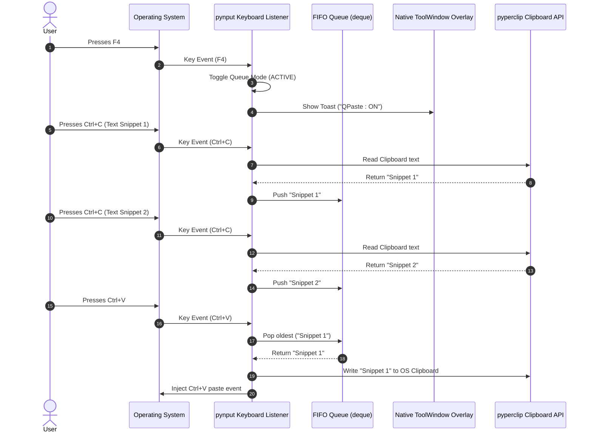

# Proof of Concept (POC) Plan & Verification Report: QPaste Engine

> **Document Purpose:** Outline and document the technical validation results for QPaste's core features (global keyboard listener, FIFO queue, native toolwindow toast overlay, and system clipboard interoperability).
> **Status:** Completed & Verified  

---

## 1. POC Objectives

The core architecture validates 4 fundamental technical requirements:

1. **Global Keyboard Interception (`pynput`)**:
   - Verify global capture of `F4` (Master Toggle), `Shift + F4` (Clear Queue), `Ctrl+C`, and `Ctrl+V` across external applications.
2. **Thread Safety (`threading` + `pyperclip`)**:
   - Ensure `pynput`'s background listener thread can read/write the system clipboard via `pyperclip` without OS access locks.
3. **FIFO Queue Manipulation**:
   - Confirm that sequential copies store items in order, and sequential pastes consume items in FIFO order (`pop(0)`).
4. **Native ToolWindow Overlay (`WS_EX_TOOLWINDOW` | `WS_EX_NOACTIVATE`)**:
   - Verify that state notifications display cleanly in the bottom-right corner with zero taskbar presence and zero focus stealing.

---

## 2. Technical Architecture of the POC

---

## 3. POC Test Verification Checklist

| Test Case | Step | Expected Result | Pass / Fail |
| :--- | :--- | :--- | :--- |
| **TC-1: Toggle Mode** | Press `F4` in any app | State toggles `ACTIVE` / `PAUSED` and fires notification | ✅ Pass |
| **TC-2: Sequential Copy** | Copy 3 text snippets with Queue Mode `ACTIVE` | Queue contains 3 items in exact copied order | ✅ Pass |
| **TC-3: Sequential Paste** | Paste 3 times | Pasted items output in FIFO order (Item 1, then Item 2, then Item 3) | ✅ Pass |
| **TC-4: Mode Deactivation** | Press `F4` to turn OFF, then copy/paste | OS defaults to standard single-item copy/paste | ✅ Pass |
| **TC-5: Clear Queue** | Press `Shift + F4` with items in queue | Queue is completely emptied, fires `QPaste : Cleared` toast | ✅ Pass |
| **TC-6: Native ToolWindow Overlay** | Fire hotkey toast in any app | Toast pops up bottom-right with 0 taskbar icons & 0 focus stealing | ✅ Pass |
| **TC-7: Silent Background Startup** | Launch `python src/main.py` | App starts silently in system tray without any window flashing | ✅ Pass |

---

## 4. Next Implementation Step

Core implementation and automated unit tests (`pytest`) are complete. Proceed with packaging via `PyInstaller` into a standalone `.exe`.

