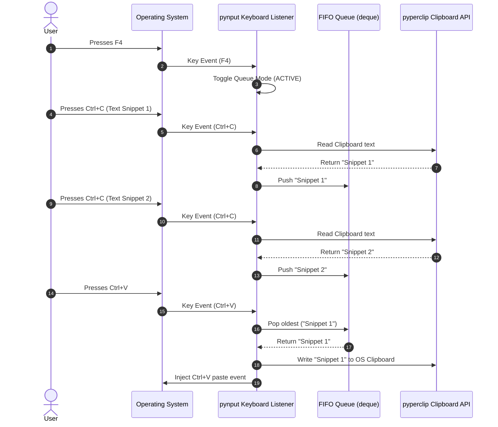

# Proof of Concept (POC) Plan: QPaste Engine

> **Document Purpose:** Outline the technical validation plan for QPaste's core features (global keyboard listener, FIFO queue, and system clipboard interoperability) before full UI integration.

---

## 1. POC Objectives

Before building the complete Flet HUD interface and packaging the app, we need to validate 3 fundamental technical requirements:

1. **Global Keyboard Interception (`pynput`)**:
   - Verify global capture of `F4` (Master Toggle), `Ctrl+C`, and `Ctrl+V` across external applications (Notepad, browser, IDE, etc.).
2. **Thread Safety (`threading` + `pyperclip`)**:
   - Ensure `pynput`'s background listener thread can read/write the system clipboard via `pyperclip` without freezing or throwing OS access locks.
3. **FIFO Queue Manipulation**:
   - Confirm that sequential copies store items in order, and sequential pastes consume items in FIFO order (`pop(0)`).

---

## 2. Technical Architecture of the POC

---

## 3. POC Test Verification Checklist

| Test Case | Step | Expected Result | Pass / Fail |
| :--- | :--- | :--- | :--- |
| **TC-1: Toggle Mode** | Press `F4` in any app | Console prints `Queue Mode: ACTIVE` / `PAUSED` | 🟩 Pending |
| **TC-2: Sequential Copy** | Copy 3 text snippets with Queue Mode `ACTIVE` | Queue contains 3 items in exact copied order | 🟩 Pending |
| **TC-3: Sequential Paste** | Paste 3 times | Pasted items output in FIFO order (Item 1, then Item 2, then Item 3) | 🟩 Pending |
| **TC-4: Mode Deactivation** | Press `F4` to turn OFF, then copy/paste | OS defaults to standard single-item copy/paste | 🟩 Pending |
| **TC-5: Clear Queue** | Press `Shift + F4` with items in queue | Queue is completely emptied, console prints `Queue Cleared` | 🟩 Pending |

---

## 4. Next Implementation Step

Upon approval of this POC plan, we will create a lightweight validation script `src/poc_test.py` to run directly in your terminal and test keyboard hook behavior on your system.
