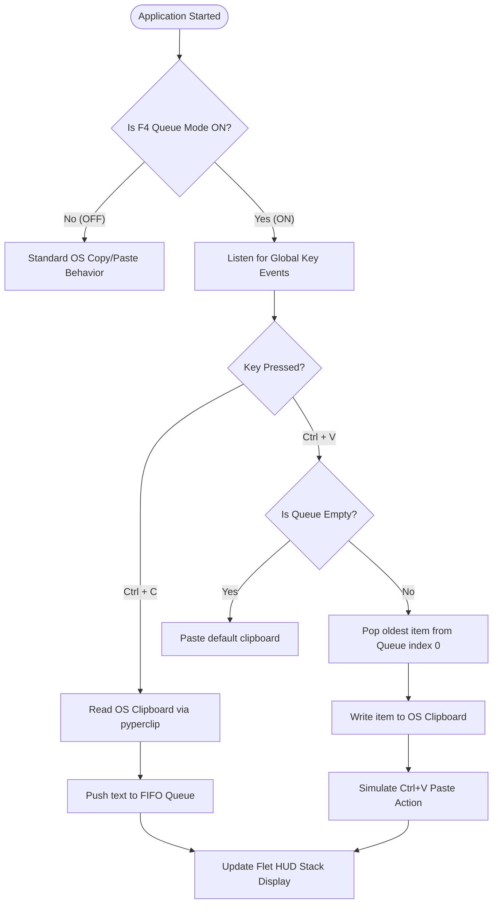

# Product Requirements Document (PRD): QPaste

> **Project Name:** QPaste  
> **Type:** Desktop Utility (Windows & Linux)  
> **Status:** Specification / Design Phase  
> **Version:** 1.0.0  

---

## 1. Overview & Vision

**QPaste** is a lightweight, high-performance desktop utility for Windows and Linux designed for developers, researchers, and power users. Standard operating system clipboards only retain the single most recently copied item, forcing users to repeatedly switch windows back and forth when copying multiple snippets.

QPaste solves this by introducing a **Sequential FIFO (First-In, First-Out) Clipboard Manager**. Users can copy multiple text items sequentially using standard operating system shortcuts (`Ctrl+C`), and paste them in the exact chronological order they were collected (`Ctrl+V`).

---

## 2. Technology Stack

| Layer | Technology | Purpose |
| :--- | :--- | :--- |
| **Language** | Python 3.9+ | Core application runtime & business logic |
| **GUI & HUD** | Flet (Flutter engine for Python) | Transparent, frameless HUD & control window |
| **Keyboard Listener** | `pynput` | Global OS-level background hotkey interception |
| **Clipboard API** | `pyperclip` | Cross-platform OS clipboard read/write interface |
| **Concurrency** | Python `threading` | Non-blocking execution of listener & UI loop |

---

## 3. Core User Flow & Shortcut Controls

### Key Controls & Triggers

1. **Master Toggle (`F4`)**:
   - Toggles **Queue Mode** `ON` or `OFF`.
   - When **OFF**: Keyboard shortcuts pass through naturally; QPaste remains idle.
   - When **ON**: `Ctrl+C` and `Ctrl+V` are handled by QPaste's FIFO engine, and the HUD reflects active items.

2. **Clear Queue (`Shift + F4`)**:
   - Clears all items currently stored in the FIFO queue and empties the HUD display.

3. **Copy Action (`Ctrl+C` / `Cmd+C`)**:
   - Intercepted when Queue Mode is `ON`.
   - Reads newly copied text via `pyperclip`.
   - Appends text to the back of the FIFO queue.
   - Triggers an instant visual update on the Flet HUD.

4. **Paste Action (`Ctrl+V` / `Cmd+V`)**:
   - Intercepted when Queue Mode is `ON`.
   - If Queue has items: Pops the oldest item (`pop(0)`), updates OS clipboard via `pyperclip`, and pastes it into the focused target application.
   - If Queue is empty: Plays subtle visual indicator on HUD or falls back to normal clipboard behavior.

---

## 4. Functional Requirements

### 4.1 Master Toggle & State Machine
- `REQ-1.1`: The app must listen globally for `F4` to enable/disable Queue Mode at any time.
- `REQ-1.2`: The Flet HUD must visually indicate the state (`ACTIVE / QUEUE MODE` vs `PAUSED / DIRECT MODE`).

### 4.2 Queue Management Engine
- `REQ-2.1`: Maintain a thread-safe list/deque of text strings.
- `REQ-2.2`: Ignore duplicate consecutive copies if configured (optional setting).
- `REQ-2.3`: Provide a shortcut/button to clear the queue completely (e.g. `Shift + F4` or HUD button).

### 4.3 Flet HUD UI
- `REQ-3.1`: Frameless, semi-transparent overlay window (`always_on_top = True`).
- `REQ-3.2`: Displays a live list of queued snippets with line truncation for long text.
- `REQ-3.3`: Highlights the next item scheduled to be popped/pasted.

---

## 5. Non-Functional Requirements

- **Performance**: Keyboard event latency must be $< 15\text{ ms}$ to prevent typing delay.
- **Resource Footprint**: Memory usage under $60\text{ MB RAM}$; CPU usage $< 1\%$ when idle.
- **Cross-Platform Compatibility**: Tested and verified on Windows 10/11 and Linux (X11 & Wayland).

---

## 6. Edge Cases & Handling Strategies

| Scenario | Risk | Mitigation Strategy |
| :--- | :--- | :--- |
| **Empty Queue on `Ctrl+V`** | App crash or lost paste | Passthrough to native OS clipboard paste |
| **Rapid `Ctrl+C` Spamming** | Race condition in clipboard | Debounce clipboard read operations by $50\text{ ms}$ |
| **Huge Text Payload** | UI lag on Flet HUD | Truncate HUD preview to first 100 characters |
| **Password Managers** | Exposing sensitive data in queue | Auto-expire items or provide quick-clear shortcut |
